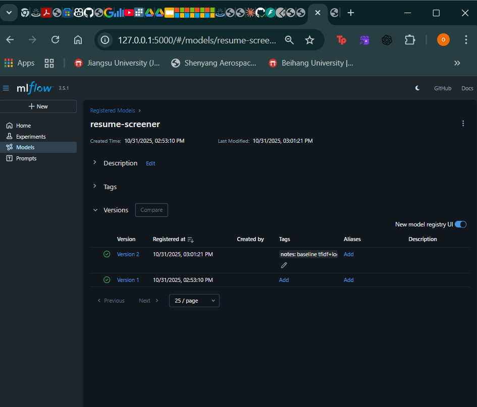
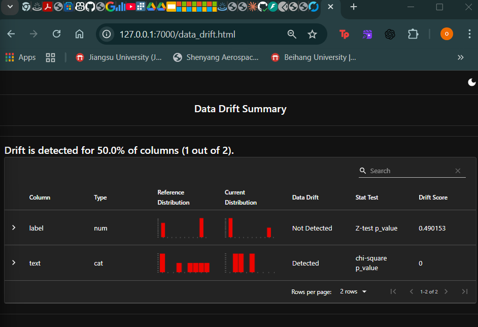
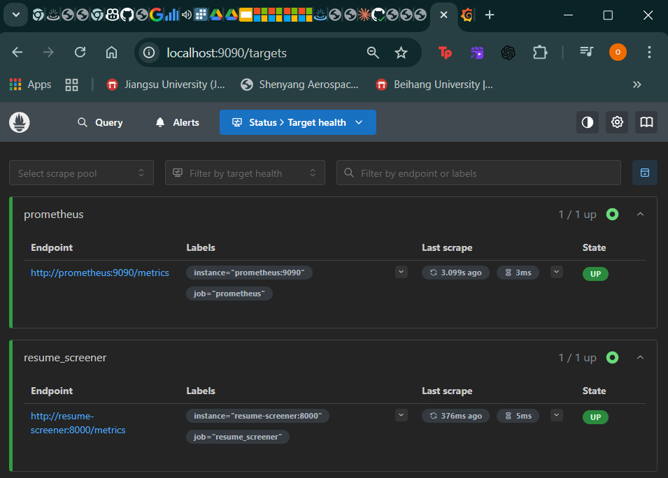

# Resume Screener

## Project Overview:
The Resume Screener is a tool designed to screen resumes against a given job description, calculating the similarity between the two. It uses machine learning techniques to compare the contents of a resume with the requirements of the job, helping recruiters to easily shortlist candidates based on relevance.

## Features:
- Resume screening based on job description
- Text pre-processing with scikit-learn
- Cosine similarity to calculate match between resume and job description
- FastAPI-based API for integration

## Getting Started:
1. Clone the repository:
   ```bash
   git clone https://github.com/omeranwel/resume-screener.git

## MLflow Tracking & Model Registry
- **Tracking URI**: `http://127.0.0.1:5000`
- **Experiment**: `resume-screener-exp`
- **Registered Model**: `resume-screener` (current: v1)
  - Open MLflow UI → **Models** → `resume-screener` → Version 1

  

## 📊 Evidently Data Drift Dashboard
Evidently AI was used to generate a **data drift dashboard** comparing reference and current data distributions.

  

  ## 🧠 Monitoring Dashboard

- **MLflow UI** → http://127.0.0.1:5000
  Tracks experiments, models, and metrics.
  Registered Model: `resume-screener v1`

- **Evidently Data Drift Dashboard** → http://127.0.0.1:7000/data_drift.html
  Shows column drift detection (label, text).

- **Prometheus Metrics** → http://127.0.0.1:9090
  Collects FastAPI `/metrics` and GPU stats.

- **Grafana Dashboard** → http://127.0.0.1:3000
  Visualizes request rate, latency, and GPU utilization.

- **FastAPI Health Endpoint** → http://127.0.0.1:8000/health
  Status: ✅ Healthy

  
  
  
